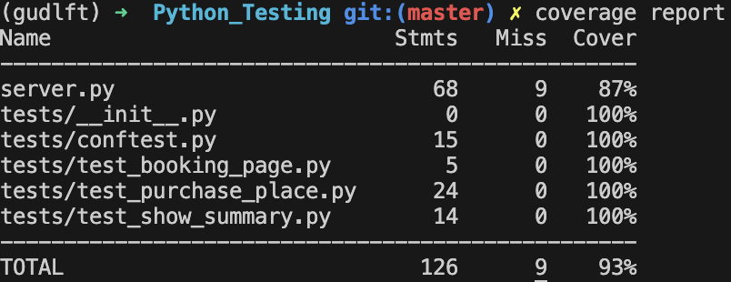

# GÜDLFT : Projet d'école [OpenClassrooms](https://openclassrooms.com/fr) - Améliorez une application Web Python par des tests et du débogage

GUDLFT est une application web conçue pour les organisateurs de compétitions locales et régionales. L'application permet aux secrétaires de clubs de réserver des places pour des compétitions en utilisant les points accumulés, tout en garantissant une participation équitable entre tous les clubs.


## Installation et exécution

### Prérequis

- Python 3.9 ou version supérieur
- pip (gestionnaire de paquets Python)

### Étapes d'installation

1. **Cloner le dépôt** :
   ```bash
   git clone https://github.com/Jbguerin13/Python_Testing.git
   cd gudlft/PYTHON_TESTING
   ```

2. **Créer un environnement virtuel** :
   Sous Windows :
   ```bash
   python -m venv env
   env\Scripts\activate
   ```
   Sous macOS/Linux :
   ```bash
   python3 -m venv env
   source env/bin/activate
   ```

3. **Installer les dépendances** :
   ```bash
   pip install -r requirements.txt
   ```

4. **Lancer le serveur** :
   ```bash
    export FLASK_APP=server.py
    flask run 
    ```

5. **📌 Fonctionnalités** :

    - **Authentification des utilisateurs** : Connexion par e-mail pour les secrétaires de clubs.
    - **Système de réservation** : Utilisation des points des clubs pour réserver des places aux compétitions.
    - **Gestion des points** : Affichage du solde des points et mise à jour après réservation.
    - **Limites de réservation** : Un club ne peut pas réserver plus de 12 places par compétition.
    - **Tableau des points** : Affichage public des points de tous les clubs pour assurer la transparence.

6. **Lancement des tests** :
    ```bash
    make test 
    ```
<br>

   **Coverage report**

<br>


   

